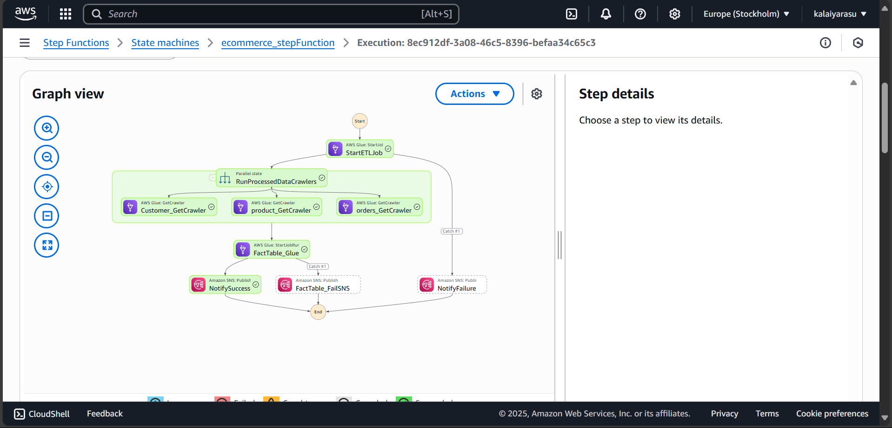

# E-Commerce-Data-Pipeline-using-AWS

This project demonstrates a production-grade serverless pipeline that processes e-commerce data from ingestion to analytics-ready output using AWS services like S3, Lambda, Step Functions, Glue, and SNS.

---

### Architecture


### Tech Stack
S3:	Data lake (raw and processed)
Lambda:	S3 event trigger
Step Functions:	Workflow orchestration
AWS Glue:	ETL jobs + catalog
Glue Crawler:	Schema inference/cataloging
SNS:	Job failure alerts
Redshift Spectrum:	Query external fact 

## Workflow Overview

### Trigger-to-Analytics Flow

1. **New raw data** (`orders`, `customers`, `products`) is uploaded to: s3://ecommerce-project-aws/ecommerce-data-raw/

2.  An **S3 event** triggers a **Lambda function**.

3.  The Lambda function **starts a Step Function** which:
1.  Runs **Glue Job 1** to clean and process raw data  
2.  Runs a **Glue Crawler** to catalog processed data  
3.  Runs **Glue Job 2** to create a `fact_sales` table from the processed data  
4.  Sends **SNS notification** (only if any job fails)

>  The Step Function is responsible for full orchestration. If any job fails, it **immediately notifies via SNS**.



---

## Glue Job 1 – Glue Job DataProcessing

### 📥 Input from S3 (`/ecommerce-data-raw/`)
- **orders**, **customers**, and **products** CSV files

### 🔄 Transformations:
| Dataset    | Logic |
|------------|-------|
| `orders`   | Cleans nulls, extracts date parts, creates `order_category`, flags `is_weekend` |
| `customers`| Adds `customer_segment` and `registration_year` |
| `products` | Adds `price_category` and `is_in_stock` |

### Output to S3 (`/ecommerce-data-processed/`)
- Format: Parquet  
- Partitioned: by `order_year`, `order_month`

---

## Glue Crawler – Processed Layer Cataloging

- Automatically catalogs the processed data into the **ecommerce_database**
- Registers the following tables:
- `orders_orders`
- `customers_customers`
- `products_products`

---

## Glue Job 2 – `fact_sales` Table Creation

### Join Logic
```text
orders JOIN customers ON customer_id
    JOIN products  ON product_id
```


### Output:
A curated fact_sales table written to: s3://ecommerce-project-aws/ecommerce-data-processed/fact_sales/
Partitioned by order_year, order_month
Columns in fact_sales
order_id, order_date, order_total, quantity, order_category, customer_segment, category, price_category

